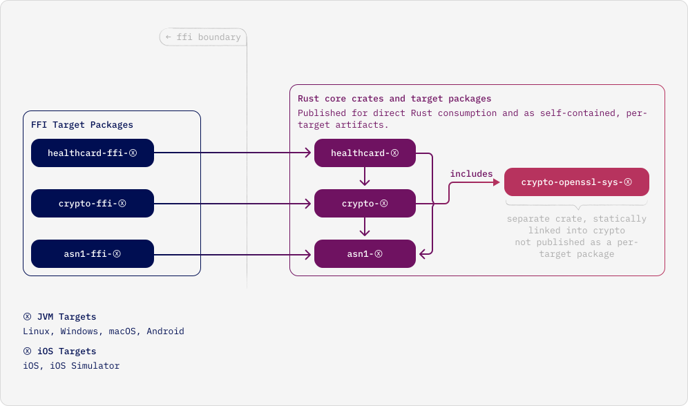

<!--
SPDX-FileCopyrightText: Copyright 2025 gematik GmbH

SPDX-License-Identifier: Apache-2.0

Licensed under the Apache License, Version 2.0 (the "License");
you may not use this file except in compliance with the License.
You may obtain a copy of the License at

    http://www.apache.org/licenses/LICENSE-2.0

Unless required by applicable law or agreed to in writing, software
distributed under the License is distributed on an "AS IS" BASIS,
WITHOUT WARRANTIES OR CONDITIONS OF ANY KIND, either express or implied.
See the License for the specific language governing permissions and
limitations under the License.

*******

For additional notes and disclaimer from gematik and in case of changes by gematik,
find details in the "Readme" file.
-->

# OpenHealth-Core Architecture (for Contributors)

This document is for developers extending OpenHealth-Core. It explains the main architectural principles and where new features and modules should typically live, without tying the description too closely to any single domain or current implementation detail.

It deliberately avoids low-level type or function descriptions; those are best understood directly from the crate sources.

## 1. Architectural Goals

OpenHealth-Core is designed to:

- Provide reusable cryptographic and parsing building blocks.
- Model protocol- or product-specific domain behaviour in a modular way (currently healthcard/eGK, potentially more in the future).
- Be portable across platforms and languages (Rust core, bindings on top).
- Stay easy to extend without breaking existing integrations.

This leads to a few core goals for contributors:

- New features align with the existing layering instead of introducing arbitrary cross-dependencies.
- The public API (especially FFI/UniFFI) evolves carefully and predictably.
- Cryptographic and I/O backend details stay isolated behind clear boundaries.

## 2. Big Picture: Layers and Responsibilities

The workspace is organized into a few architectural layers:

- **Format / utility layer** – generic tooling such as ASN.1 encoding/decoding.
- **Cryptographic core** – high-level primitives and key handling on top of low-level crypto FFI.
- **Domain / protocol modules** – concrete application logic (for example, healthcard/eGK flows today).
- **Bindings and examples** – language bindings and small sample applications.

Current crates and projects fit into these layers as follows (non-exhaustive, for orientation only):

- `asn1` – format / utility layer.
- `crypto`, `crypto-openssl-sys` – cryptographic core.
- `healthcard` – domain / protocol module.
- `core-modules-kotlin/*` – bindings and examples.

Dependency direction is **one-way**, from higher layers downwards (domain → crypto → low-level FFI), and new modules should follow the same pattern.

### 2.1 Dependency Architecture Overview (JVM/UniFFI Artifacts)

The following diagram illustrates the intended dependency direction for the JVM/UniFFI build artifacts:

When adding new code, first decide which layer it conceptually belongs to:

- Generic parsing/encoding or helpers → format / utility layer.
- Pure crypto or key material handling → cryptographic core.
- Protocol- or product-specific logic → domain / protocol modules.
- Interop with a new host language → bindings layer on top of domain modules.

## 3. Key Architectural Rules

These rules should guide all new features and modules:

1. **Respect layering**
   - Domain modules should use cryptography only via shared crypto crates and parsing only via shared utility crates.
   - Direct use of low-level FFI (such as OpenSSL bindings) should be confined to dedicated “sys” crates.

2. **Keep the public surface small**
   - Prefer internal modules and re-exported “facades” over exposing every type.
   - Treat the FFI/UniFFI layer as a stable contract: new features should be added there only when needed by external consumers.

3. **Separation of concerns**
   - I/O with external systems (smartcards, network backends, etc.) should be abstracted behind narrow interfaces. Do not mix backend-specific APIs into domain logic.
   - Cryptographic parameter choices live in crypto crates; protocol and product flows live in domain modules.

4. **Backward compatibility**
   - Avoid breaking existing UniFFI types and methods if at all possible.
   - Where breaking changes are unavoidable, prefer additive strategies (new methods or types) rather than changing existing signatures.

## 4. Extension Cookbook

This section describes where and how to implement typical future features.

### 4.1 New healthcard operations

Examples: “read a new file”, “add a new PIN‑related operation”, “add a new card‑level service”.

Recommended steps:

1. **Model the domain concept**
   - Add or extend types under `healthcard/src/card`, `identifier`, or `exchange` to represent new files, IDs, or results.

2. **Add APDU/command support**
   - Create or extend command builders under `healthcard/src/command` (e.g. new `*_command.rs` modules).
   - Use `HealthCardCommand` to associate expected status words with the APDU.

3. **Add a high-level operation**
   - Add a function under `healthcard/src/exchange` that:
     - Accepts an abstract card session/transport and domain parameters.
     - Composes the required commands and maps responses into domain types.
     - Returns a domain-friendly error type defined in `healthcard`.

4. **Expose to other languages (optional)**
   - If the feature should be available on the JVM, add a UniFFI-exposed function or method in the `ffi` module that wraps the new exchange function.

5. **Test at the right level**
   - Unit tests for APDU encoding/decoding and command composition.
   - Where feasible, integration-style tests using a mocked card transport.

### 4.2 New cryptographic primitives or algorithms

Examples: “support another AES mode”, “add new digest/ML‑KEM variant”, “change key derivation”.

Recommended steps:

1. **Design the public surface in `crypto`**
   - Add or extend enums and types (e.g. cipher specs, key types) under `crypto/src`.
   - Keep them generic and independent of healthcard protocol details.

2. **Implement using internal OpenSSL wrappers**
   - Use `crypto::ossl` modules only inside `crypto`.
   - Ensure memory and key material handling follows existing patterns (e.g. using `SecretKey`, zeroization, etc.).

3. **Add tests**
   - Prefer known-good test vectors (RFCs or standard documents) where available.

4. **Adopt in `healthcard`**
   - Only after the primitive is stable in `crypto`, use it from `healthcard` for new flows (e.g. different secure messaging variants or KDFs).

### 4.3 New card transports

Examples: “support a different smartcard stack”, “add a pure-Rust PC/SC backend”, “add a mocked in-memory channel”.

Recommended steps:

1. **Implement a card-transport abstraction**
   - Create a new module or crate that:
     - Knows whether extended-length APDUs are supported.
     - Converts a command APDU into a response APDU using a specific reader stack.
   - Map backend-specific failures into the domain error type used by exchange functions.

2. **Reuse existing helpers**
   - Where possible, reuse existing helpers in `healthcard` for composing and validating APDUs instead of duplicating orchestration logic.

3. **Expose to other languages (optional)**
   - For JVM or other hosts: provide a thin adapter around the platform’s smartcard API that implements the chosen card-transport abstraction.

### 4.4 New bindings / host languages (via UniFFI)

UniFFI is the fixed FFI mechanism for OpenHealth-Core. New host languages should be added as UniFFI bindings on top of the existing `healthcard` crate, not via ad‑hoc FFI layers.

When adding a new language:

1. **Extend UniFFI configuration**
   - Add a new `[bindings.<language>]` section to `core-modules/healthcard/uniffi.toml` (or a dedicated UniFFI config if the language requires it).
   - Reuse the existing UniFFI-exposed types and functions as much as possible; only extend the FFI surface when a new feature is needed by at least one host language.

2. **Generate bindings using the UniFFI CLI**
   - Follow the Kotlin pipeline as an example:
     - Build the Rust `healthcard` crate as a `cdylib`.
     - Run `uniffi-bindgen` for the new language with the shared UniFFI config.
   - Place generated code and metadata under a language-specific build directory (analogous to `core-modules-kotlin/healthcard`).

3. **Mirror the existing conceptual surface**
   - Expose (at minimum):
     - A way to plug in host-specific card I/O (card-transport abstraction).
     - A way to establish a secure session with the card (PACE + secure messaging).
     - A small set of high-level operations that make sense for that host.
   - Keep the mapping conceptually close to the Rust/UniFFI definitions for consistency across languages, without leaking internal type names.

4. **Keep host code thin**
   - Do not re‑implement protocol logic in the host language.
   - Treat the host code as:
     - an adapter from the host’s card I/O API into the UniFFI-exposed card-transport abstraction, and
     - a thin façade around UniFFI-generated calls into Rust.

## 5. Things to Avoid

To keep the architecture maintainable:

- Do not:
  - Depend on `crypto-openssl-sys` outside the `crypto` crate.
  - Introduce new global singletons or thread‑local state for card or crypto logic.
  - Leak transport-specific types (PC/SC, smartcardio, etc.) into `healthcard` modules.
  - Add large, feature-specific APIs directly to the FFI surface without first designing them in Rust.

- Do:
  - Add small, composable Rust APIs first; expose them via FFI only as needed.
  - Follow existing naming and module placement patterns when in doubt.

If you are unsure where a new feature belongs, start by locating the closest existing feature in the tree and mimic its placement and structure. This is usually a good indicator of the intended architecture.
